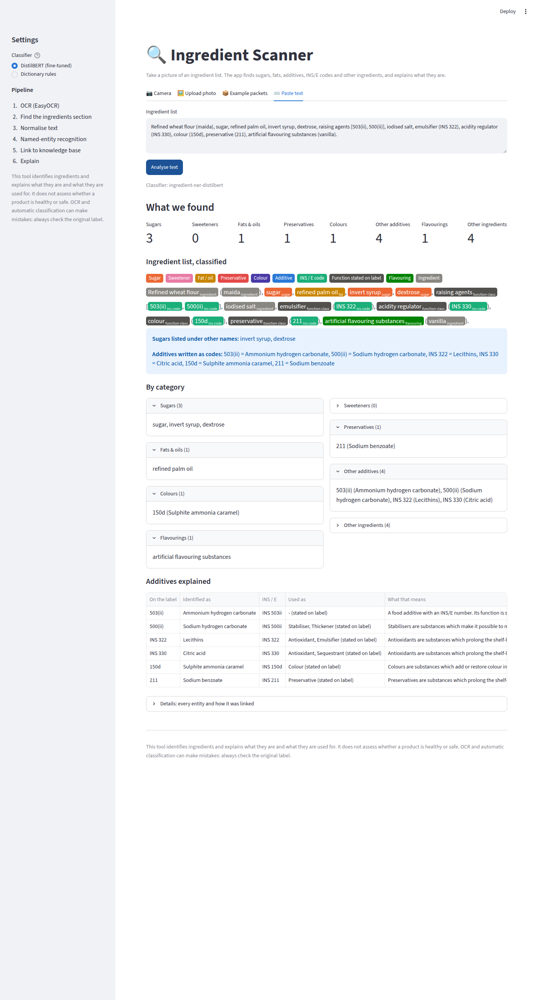
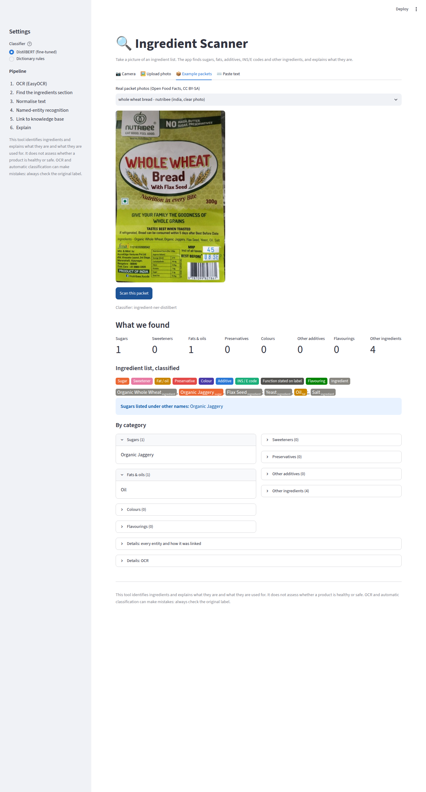

# Ingredient Scanner

*NLP-Based Detection and Interpretation of Hidden Food Ingredients*

Take a picture of a food packet's ingredient list. The app reads it (OCR), finds every ingredient
(a fine-tuned DistilBERT NER model), and explains it in plain language:
- sugars, including the ones under other names (dextrose, jaggery, invert syrup)
- fats, sweeteners, preservatives, colours and other additives
- INS/E codes translated into names and functions: *INS 330 → citric acid → acidity regulator*

The system **identifies and interprets** ingredients. It makes **no health claims**.

```
PACKET IMAGE → OCR (EasyOCR) → code clean-up → INGREDIENTS SECTION → TEXT NORMALISATION
→ NER (DistilBERT, OCR-noise augmented) → ENTITY LINKING (knowledge base) → CATEGORY SUMMARY → APP
```



## Quick start: run the app

```bash
cd ingredient-scanner
pip install -r requirements.txt            # CPU is enough
streamlit run src/app/streamlit_app.py     # http://localhost:8501
```

Tabs: **Camera** (take a picture), **Upload photo**, **Example packets** (60 real photos), **Paste text**.
Docker and free hosting (Hugging Face Spaces): [`docs/DEPLOYMENT.md`](docs/DEPLOYMENT.md).

```python
from src.app.scanner import IngredientScanner                       # the same pipeline from Python
result = IngredientScanner().scan_image("data/images/packets/8901063162518.jpg")
result["summary"]["groups"]["SUGAR"], result["summary"]["hidden"]
```

## Project structure (three team roles)

| Part | Who | Code | Main outputs |
|---|---|---|---|
| Data + NLP | Person 1 | `src/data`, `src/preprocessing`, `src/labeling`, `src/annotation`, `src/baseline`, `src/evaluation` | 22k-product dataset, schema, silver labels, splits, gold workflow, rule baseline |
| Deep learning NER | Person 2 | `src/ner` | CRF, DistilBERT (+augmentation, +CRF), BERT; comparison; exported model `models/ingredient-ner-distilbert` |
| OCR + KB + app | Person 3 | `src/ocr`, `src/kb`, `src/app` | EasyOCR pipeline, knowledge base, entity linking, scanner, Streamlit app, Docker |

Notebooks with outputs and viva explanations:
- [`notebooks/ingredient_scanner_person1_pipeline.ipynb`](notebooks/ingredient_scanner_person1_pipeline.ipynb)
- [`notebooks/ingredient_scanner_person2_person3.ipynb`](notebooks/ingredient_scanner_person2_person3.ipynb)

| Key document | Content |
|---|---|
| [`reports/entity_schema.md`](reports/entity_schema.md) | 10 labels, annotation rules, overlap policy, ambiguous terms |
| [`data/splits/README.md`](data/splits/README.md) | dataset card (format, label2id, loading, scoring) |
| [`reports/model_comparison.md`](reports/model_comparison.md) | all NER systems, per-class scores |
| [`models/ingredient-ner-distilbert/README.md`](models/ingredient-ner-distilbert/README.md) | model card |
| [`reports/project_plan.md`](reports/project_plan.md) | design decisions |

## Results at a glance

**NER systems** (strict entity-level micro F1; same 8,000 silver training sentences for every learned
model; 1,000 held-out test products):

| System | Clean text (silver test) | 5% OCR noise | 10% OCR noise | Sentences / s (CPU) |
|---|---:|---:|---:|---:|
| Dictionary + rules (baseline) | 1.000\* | 0.862 | 0.734 | 1114 |
| CRF (hand-made features) | 0.949 | 0.872 | 0.796 | 664 |
| BERT-base (cased) | 0.929 | 0.852 | 0.767 | 14 |
| DistilBERT | 0.943 | 0.834 | 0.719 | 47 |
| DistilBERT + CRF layer | 0.950 | 0.851 | 0.747 | 48 |
| **DistilBERT + OCR-noise augmentation (final model)** | 0.940 | **0.922** | **0.900** | 45 |

\* The silver labels are the dictionary's own output, so 1.0 is by construction. Clean-text scores show
how well a model learned the labelling policy on unseen products. The noisy columns show robustness to
OCR errors, the realistic setting for photos.

**End to end on 60 real packet photos** (held-out test products, `python -m src.ocr.evaluate_ocr`):
- OCR reads a median 72% of the ingredient words. 42 of 60 photos are readable (≥ 50% of words).
- Additives identified by the final pipeline: precision 0.97, recall 0.48 (rules: 0.96 / 0.41).
- On readable photos, entity F1 is 0.65 (fuzzy match). The remaining gap comes mostly from photos where
  the print is too small or blurred to read.

**Human-verified gold evaluation: pending.** The annotation files for 400 products are ready
(section 7). After annotation, `python run_pipeline.py` and `python -m src.ner.evaluate_models` add
gold scores to every table automatically.

# Part 1: Data + NLP (Person 1)

## 1. Installation

Python 3.10+. From this folder (`ingredient-scanner/`):

```bash
python -m venv .venv
# Windows: .venv\Scripts\activate      macOS/Linux: source .venv/bin/activate
pip install -r requirements.txt
python -m pytest -q          # 45 tests
```

Every command is run from `ingredient-scanner/` and all paths are relative.

**Run everything** (about 3 minutes; uses the committed `products.csv`, no download):

```bash
python run_pipeline.py              # add --from-raw to also re-download and re-filter (1.3 GB, ~10 min)
```

Re-running produces byte-identical files: fixed seed 42, deterministic grouping, gzip files with a fixed timestamp.

## 2. Dataset download

```bash
python -m src.data.download_dataset     # official OFF CSV export, ~1.3 GB (skipped if present)
python -m src.data.download_taxonomy    # OFF additive taxonomy, pinned commit (~1 MB)
```

* Source: the **Open Food Facts full CSV export**. The official URL is tried first, then OFF's official
  S3 mirror. `data/raw/download_manifest.json` stores URL, date, size and SHA-256. The snapshot used
  here is from 2026-10-01, 4,535,553 products.
* The taxonomy gives `data/processed/additives_reference.csv`: 731 INS/E numbers with names, synonyms
  and functional classes. INS and E numbers are one numbering system (INS 330 = E330).
* Licence: ODbL. Data © Open Food Facts contributors.

## 3. Dataset filtering

```bash
python -m src.data.filter_dataset       # one streaming pass over 4.5M rows, ~3 min
```

| Step | Products |
|---|---:|
| Full export | 4,535,553 |
| Sold in an English-speaking country group | 1,441,888 |
| Has an ingredient list (not empty / not the literal "undefined") | 531,903 |
| Length 3–1500 characters | 528,982 |
| English list (`src/data/language.py`) | 509,294 |
| No exact-duplicate list | 405,812 |
| **Sampled per market, seed 42** | **22,355** |

Markets: `india` (all 4,355 usable), `uk_ireland` 7,000, `north_america` 7,000, `other_english` 4,000.
India writes additive codes in 42% of products ("INS 330", "(330)"), the UK in ~10% ("E330"), and
North America in <1% ("Red 40"). Mixing markets covers every notation. The output is
`data/processed/products.csv`, where `ingredients_text_raw` is never modified.

## 4. EDA

```bash
python -m src.data.eda              # figures 01-06, reports/dataset_statistics.md
python -m src.labeling.silver_report # figures 07-08 (entity-label distribution), reports/silver_statistics.md
```

| Figure | Shows |
|---|---|
| 01 | filtering funnel; missing values in the full export |
| 02 | ingredient-list length (characters, segments) |
| 03 | most frequent ingredient terms |
| 04 | most frequent additives; how codes are written per market |
| 05 | possible functional classes of detected additives |
| 06 | products per market; top categories |
| 07 | silver entities per label; % of products containing each label per market |
| 08 | which rule family produced each label |
| 11 | baseline robustness to OCR-like noise |

## 5. Preprocessing

```python
from src.preprocessing.pipeline import process_ingredient_text
r = process_ingredient_text("SUGAR, Acidity Regulator (INS 330)\nemulsi-\nfier")
r["text"]            # 'SUGAR, Acidity Regulator (INS 330) emulsifier'
r["tokens"]          # word tokens; r["token_offsets"] = character offsets into r["text"]
r["additive_codes"]  # [{'text': 'INS 330', 'number': '330', 'style': 'INS', ...}]
r["segments"], r["percentages"], r["non_latin_ratio"]
```

* **Normalisation** (`normalize.py`) changes as little as possible: NFKC Unicode, HTML entities,
  OFF allergen markup `_Milk_`, quotes/dashes/bullets, OCR line-break hyphenation, whitespace. It never
  lowercases and never removes numbers or punctuation.
* **Tokenisation** (`tokenize.py`): word tokens with offsets: `E330`, `150d`, `20.7%` stay single tokens.
* **INS/E codes** (`additive_codes.py`): `E330`, `E 330`, `e-330`, `INS 330`, `INS No. 330`, `503(ii)`,
  and bare numbers after a class word (`Emulsifier (471)`). All are normalised to `330`, `503ii`, ….
  Quantities, years and "vitamin E 400 IU" are rejected.
* **Segmentation** (`segment.py`): commas, semicolons, colons and brackets, with bracket depth for compound
  ingredients. Decimal commas (`5,5%`) are not split.

## 6. Weak labelling (silver data)

```bash
python -m src.labeling.build_vocabulary   # words seen in >=3 products (filters OCR garbage)
python -m src.labeling.build_silver       # data/processed/silver.jsonl.gz + reports/silver_log.json
```

**Schema (10 labels):** SUGAR, SWEETENER, FAT, PRESERVATIVE, COLOUR, ADDITIVE, INS_CODE, FUNCTION_CLASS,
FLAVOURING, INGREDIENT. See [`reports/entity_schema.md`](reports/entity_schema.md).

**Dictionaries** (`configs/lexicons/`, plain text, editable):
- sugars, sweeteners, fats, flavourings and functional classes (hand-curated);
- additive aliases (label names mapped to INS numbers);
- all usable names from the OFF additive taxonomy;
- `additive_label_rules.yaml`: INS number → PRESERVATIVE / COLOUR / SWEETENER / ADDITIVE, with explicit exceptions and blocked ambiguous names.

**Decision order** (`weak_labeler.py`):
1. Skip statements.
2. Codes → INS_CODE.
3. Exact dictionary match.
4. Conjunctions ("A and B").
5. Multiple dictionary terms.
6. Dictionary suffix / head word ("organic cane **sugar**", "refined palm **oil**").
7. Fallback INGREDIENT.

Each silver entity stores its **rule**. `confidence` is `null` because it is never invented. It can be
measured as each rule's precision on gold train/validation data.

## 7. Gold annotation

```bash
python -m src.annotation.sample_gold          # 400 products + Doccano files (already done)
```

* **Selection:** per split (train 220 / validation 60 / test 120), so gold test stays held out.
  - About 45% is stratified random by market × length.
  - About 55% is enriched with hard or rare cases (INS codes, preservatives, colours, sweeteners, several sugars/fats, noisy text).
  - `annotation_tracking.csv` records why each product was chosen and who annotates it.
* **Tool: [Doccano](https://github.com/doccano/doccano)** (free, local).
  1. `pip install doccano` (or the Docker image), `doccano init`, `doccano createuser --username admin --password …`.
  2. Run `doccano webserver --port 8000` and, in a second terminal, `doccano task`.
  3. Create a *Sequence Labeling* project and import labels from `data/annotations/doccano_label_config.json`.
  4. Import your file `data/annotations/batches/<annotator>.jsonl`.
* **Annotate:** files are **pre-annotated** with silver labels. Check every span against the guideline,
  correct it, and approve the document. The first 40 items are shared by all annotators.
* **Agreement:** export (JSONL, *only approved*) to `data/annotations/exports/<annotator>.jsonl`, then
  run `python -m src.annotation.agreement` (entity F1 + Cohen's kappa per annotator pair). Discuss
  disagreements and save agreed versions in `exports/adjudicated.jsonl`.
* **Import:** `python -m src.annotation.import_annotations` writes `data/annotations/gold_verified.jsonl`
  and `data/splits/gold/*.jsonl`. Documents where annotators disagree are refused until adjudicated.

Rename `annotator_1..3` in `configs/data_config.yaml` → `gold.annotators` and re-run `sample_gold`
before you start.

## 8. Dataset splitting

```bash
python -m src.data.split_dataset
```

Products are grouped with union-find when they share any of these:
1. the same letters;
2. the same set of ingredient segments;
3. the same name + brand;
4. the same first 5 segments;
5. ingredient-set Jaccard ≥ 0.8.

Whole groups are assigned to 70/15/15 per market (seed 42). Measured leakage: no identical list
across splits, and 0.15% of val/test products have a ≥0.8-similar train product. Outputs:
- `data/splits/silver/{train,validation,test}.jsonl.gz`
- `data/splits/gold/…` (after annotation)
- `label2id.json`, `id2label.json`
- `data/processed/split_assignment.csv`, `reports/split_report.json`

## 9. Baseline and evaluation

```bash
python -m src.evaluation.evaluate_baseline    # needs gold test -> reports/baseline_metrics.{json,md}, figures 09-10
python -m src.evaluation.off_agreement        # no gold needed: agreement with OFF's additive parser
python -m src.evaluation.noise_robustness     # no gold needed: OCR-noise robustness, figure 11
```

* `src/baseline/dictionary_ner.py`: `DictionaryNER().predict(text)` (dictionaries + regex + rules).
* `src/evaluation/metrics.py`: **strict entity-level** P/R/F1 (micro, macro, per class) plus a partial-match
  score. This is the one shared scorer for the baseline, DistilBERT, BERT and BERT+CRF.
* The baseline is **never scored on silver labels**: silver is its own output, so the score would be
  100% and meaningless.

Results available now:

| Check | Result |
|---|---|
| Agreement with OFF's own additive parser (silver test products, additive numbers) | precision 0.85, recall 0.91, F1 0.88 |
| Baseline output under OCR-like noise (F1 vs. clean predictions) | 1% noise 0.97 · 5% 0.86 · 10% 0.74 |

## 10. Error analysis

```bash
python -m src.evaluation.error_analysis       # needs gold test
```

Writes `reports/error_analysis/baseline_errors.csv` with columns text, expected entity/label,
predicted entity/label, error type, entity category, and tags.
- **Error types:** false positive, false negative, boundary error, type error, boundary + type.
- **Tags:** INS-code variant, OCR noise, compound, unknown term, overlapping category, ambiguous term.

## 11. How Person 2 consumes the data

See [`data/splits/README.md`](data/splits/README.md). In short:

```python
from datasets import Dataset
train = Dataset.from_json("data/splits/silver/train.jsonl.gz")   # tokens + integer ner_tags
# label2id / id2label: data/splits/label2id.json, id2label.json (21 BIO tags)
from src.evaluation.metrics import evaluate_tag_sequences       # score on data/splits/gold/test.jsonl
```

- Train on silver train (optionally plus gold train).
- Select models on gold validation.
- Report only on gold test, using `evaluate_tag_sequences` so the numbers are comparable with the baseline.
- `src/evaluation/noise_robustness.add_ocr_noise` can be reused for augmentation.

## 12. How Person 3 consumes the preprocessing

```python
from src.baseline.dictionary_ner import DictionaryNER          # or Person 2's model
from src.labeling.interpret import interpret_entities, describe

result = DictionaryNER().predict(ocr_text)                       # normalises any OCR string internally
for ent in interpret_entities(result["text"], result["entities"]):
    print(ent["label"], describe(ent))   # e.g. "INS_CODE  INS 330 -> Citric acid -> acidity regulator"
```

* `process_ingredient_text(text)` alone gives normalised text, tokens and codes. It does not depend on
  Open Food Facts.
* `data/processed/additives_reference.csv` is the knowledge-base seed: number → name → functional classes.
* `declared_class` is the function written on the label, which is preferred. `reference_classes` are the
  possible functions from the taxonomy.

# Part 2: Deep learning NER (Person 2)

```bash
bash train_all_models.sh        # everything below, one job after another (~2 h on a 4-core CPU)
```

### 2.1 Pretrained models
`python -m src.ner.pretrained distilbert-base-uncased bert-base-cased` downloads the official checkpoints
from Hugging Face's original public S3 bucket into `models/pretrained/` (not in git).

### 2.2 Models (`src/ner/`)

| Script | Model |
|---|---|
| `crf_baseline.py` | Linear-chain CRF (sklearn-crfsuite). Features: word, affixes, shape, ±2 context words. No dictionary features. |
| `transformer_ner.py --model distilbert-base-uncased` | DistilBERT token classification |
| `transformer_ner.py --crf` | Same + a CRF output layer (pytorch-crf) over the word sequence |
| `transformer_ner.py --augment` | Same + OCR-noise augmentation: each epoch, half of the sentences get character confusions (l↔1, O↔0, S↔5, …) or a case change |
| `transformer_ner.py --model bert-base-cased --lr 3e-5` | BERT-base |

Training recipe:
- word labels on the first sub-word, other sub-words ignored (-100);
- AdamW, 10% warm-up + linear decay, gradient clipping, batch 16, max 256 sub-words, length-bucketed batches;
- 2 epochs, best epoch on silver validation;
- every learned model uses the same seeded 8,000-sentence training sample.

On a CPU, PyTorch jobs must run one at a time: sharing cores made training ~10× slower.

### 2.3 Evaluation and error analysis
`python -m src.ner.evaluate_models` scores every system with the shared scorer on:
- silver test;
- silver test with 5% and 10% OCR noise;
- gold test, once it exists.

It writes:
- `reports/model_comparison.{md,json}`
- figures 12–13
- one error CSV per system in `reports/error_analysis/` (false positive / negative, boundary, type errors, with tags)

**Findings:**
- On clean text every learned model reproduces the rule policy (F1 0.93–0.95). BERT-base is not better
  than DistilBERT with this data and budget, and is 3× slower.
- Without augmentation the Transformers are *not* more robust to OCR errors than the rules.
- **OCR-noise augmentation is what makes the difference** (0.90 vs 0.73 F1 at 10% noise). It wins in every
  class (figure 13), and it is the only model that recovers e.g. "dextr0se" → SUGAR or "potasium sorbate" → PRESERVATIVE.

### 2.4 Exported model
`python -m src.ner.export_model --run distilbert_aug` creates `models/ingredient-ner-distilbert/`:
- float16 safetensors in shards under 45 MB, with label2id/id2label in `config.json`;
- a model card.

```python
from transformers import pipeline
ner = pipeline("token-classification", model="models/ingredient-ner-distilbert", aggregation_strategy="first")
```

# Part 3: OCR, knowledge base and app (Person 3)

### 3.1 Knowledge base (`python -m src.kb.build_knowledge_base`, outputs in `data/knowledge_base/`)

| Table | Content |
|---|---|
| `additives.csv` | 731 INS/E numbers: name, synonyms, NER label, functional classes and their definitions, vegetarian/vegan flags, Wikidata and EFSA links |
| `function_classes.csv` | 53 classes with definitions ("Emulsifiers are substances which …") |
| `ingredient_terms.csv` | all 1,556 dictionary terms with category and INS number |
| `categories.csv` | plain-language description per category |
| `products_nutrition.csv` | nutrition per 100 g for the 22k products (available for 8,909) |

The knowledge base contains descriptions only, no health ratings. Source: Open Food Facts taxonomies (ODbL).

### 3.2 Packet images
`python -m src.ocr.collect_images` collects 60 real ingredient-label photos (24 India, 12 per other market)
from **held-out test products** in Open Food Facts' public image bucket (CC BY-SA). For each product it
picks the photo whose stored OCR text matches its known ingredient list.
Output: `data/images/packets/`, `packets.csv`.

### 3.3 OCR pipeline (`src/ocr/`)
1. `ocr_pipeline.py`: EasyOCR (CRAFT detector + CRNN recogniser). Before OCR: greyscale, upscaling and
   CLAHE contrast. After OCR: words are put in reading order, and rotations are tried if little text is found.
2. `ocr_cleanup.py`: fixes OCR errors only inside additive codes ("(I5Od)" → "(150d)", "INS 33O" → "INS 330").
3. `section_extraction.py`: finds the ingredients section. It scores every "Ingredients" occurrence
   (tolerating "lngredients"), cuts at end markers (nutrition, FSSAI, storage …), and falls back to
   comma density or the full text.

### 3.4 Entity linking (`src/kb/entity_linking.py`)
Each entity is linked to a knowledge-base entry by one of four methods, tried in order:
1. INS number
2. exact name
3. fuzzy name (Levenshtein ≥ 88, so "potasium sorbate" → potassium sorbate)
4. category description

The function stated on the label ("Emulsifier (471)") is preferred over the reference function.

### 3.5 Integrated scanner and app
- `src/app/scanner.py`: `IngredientScanner().scan_image(...)` / `scan_text(...)` returns JSON. It contains
  every entity with its link and function, a category summary, "hidden" names (sugars under other names,
  additives written as codes) and a disclaimer.
- `src/app/streamlit_app.py`: the user interface.
- `src/app/screenshot_app.py`: automated UI screenshots. These are also the end-to-end check that the app works.



### 3.6 Deployment
`Dockerfile` (CPU, everything bundled), `requirements-app.txt`, `.streamlit/config.toml`, and
[`docs/DEPLOYMENT.md`](docs/DEPLOYMENT.md) (local, Docker, Hugging Face Spaces, Streamlit Cloud).
The app has not been published to a public URL from this environment.

## Final processed files

| File | Content |
|---|---|
| `data/processed/ingredients_processed.csv` | **one row per product**: metadata, split, raw + normalised text, entities grouped by label (sugars, fats, preservatives, colours, INS numbers, …), additive interpretations, counts |
| `data/processed/silver_entities.csv.gz` | one row per entity: span, label, rule, INS number, linked name, declared/reference class |
| `data/processed/silver.jsonl.gz` | full silver records (tokens, offsets, BIO tags, entities) |
| `data/splits/` | Hugging Face-ready train/validation/test |

All entity columns are **silver** (automatic) until the gold annotation is imported.

## Limitations

* **Silver supervision.** All models learn from rule-made labels and inherit their policy and some of
  their errors. Claims about real accuracy need the human-verified gold test set, which still has to be annotated.
* **Silver label noise.** INGREDIENT (59% of entities) comes from a fallback rule. Rare words are left
  unlabelled to keep OCR garbage out.
* **Photos.** Small, curved, glossy or blurred print defeats OCR. 18 of the 60 test photos are unreadable,
  which caps end-to-end recall. Section extraction fails if the "Ingredients" heading is not read.
* **Missing separators.** When OCR loses all commas ("WHEAT FLOUR SUGAR PALM OIL …"), neither the rules
  nor the model split the ingredients correctly.
* **Compute.** CPU-only training: 8,000 sentences, 2 epochs. More data or epochs and a GPU would likely
  help, especially BERT-base.
* **Language.** English only (keyword heuristic). Bilingual EN/FR lists are removed. Mostly non-Latin
  lists (31) are skipped.
* **Knowledge base.** OFF functional classes are incomplete (e.g. lactic acid has none). The label's
  declared class is preferred.
* **No health claims.** The app identifies and explains ingredients. It does not rate products.
