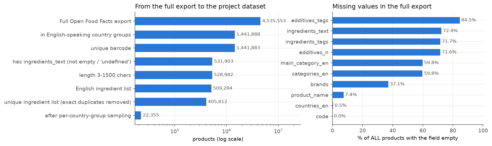
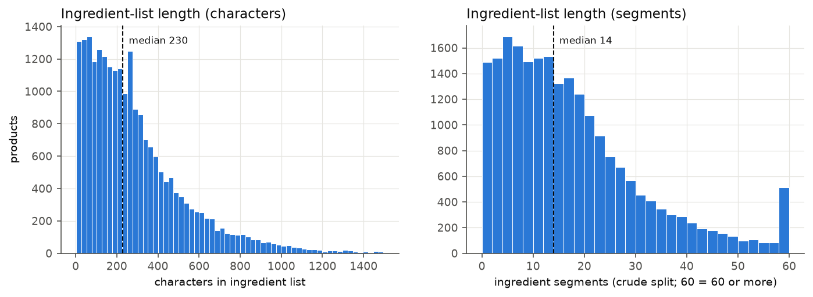
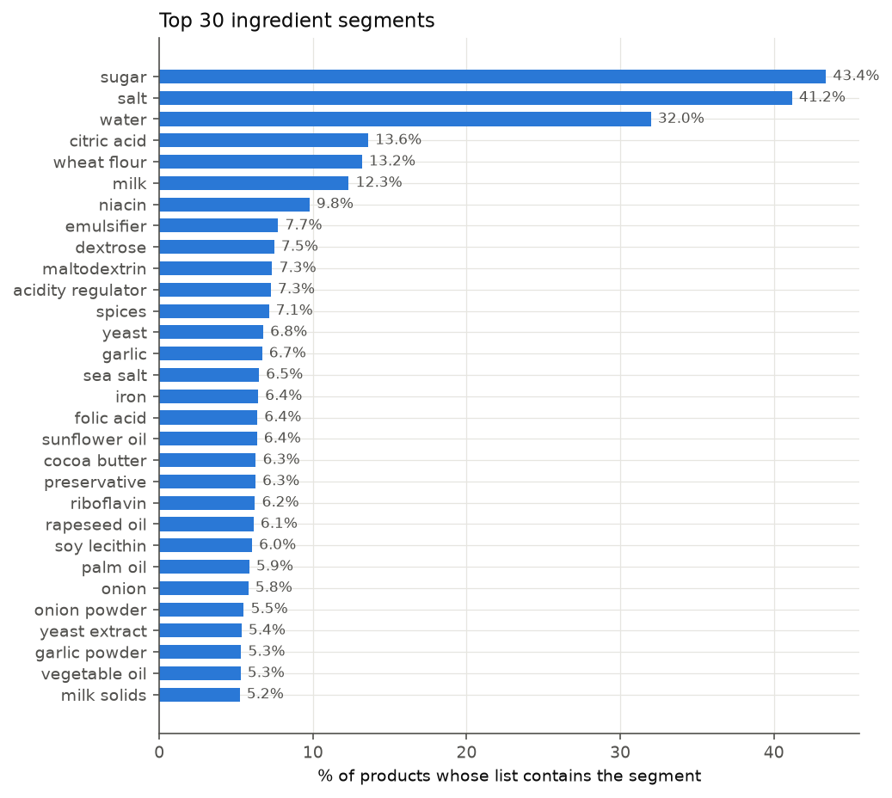
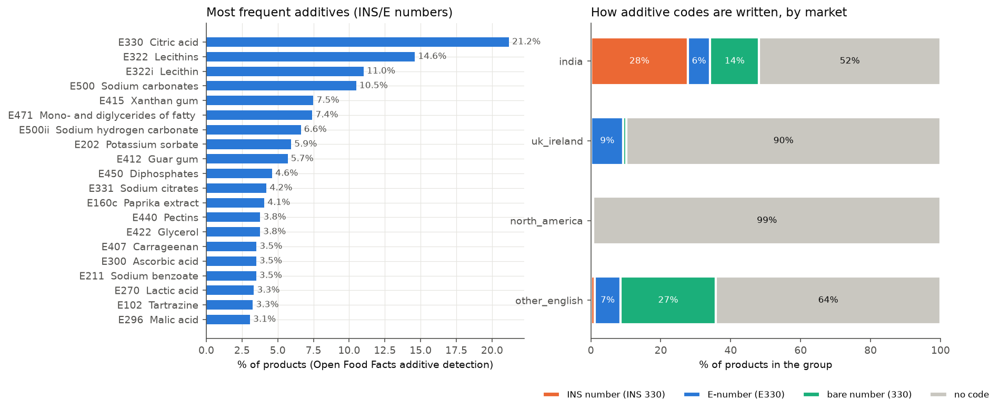
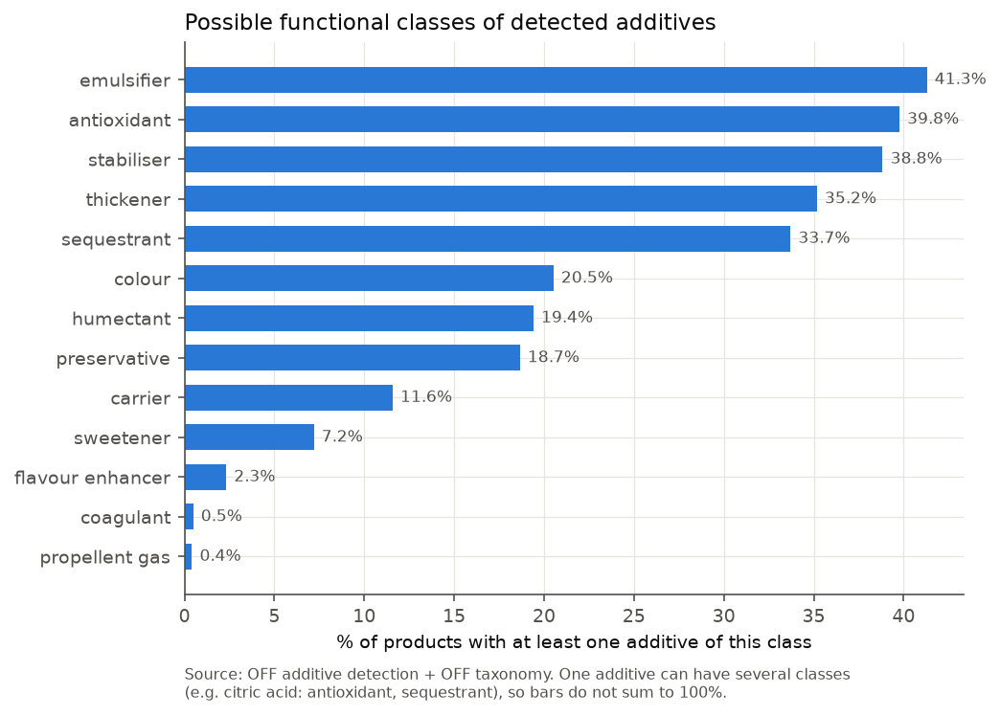
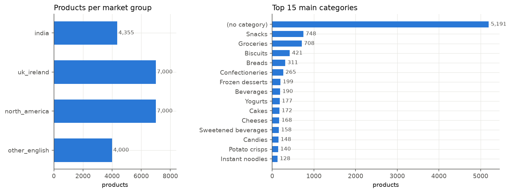

# Dataset statistics (auto-generated by `python -m src.data.eda`)

Do not edit by hand - rerun the script instead.

## 1. Source and filtering

* Full Open Food Facts export: **4,535,553 products**; `ingredients_text` empty for **72.4%** of them.
* Project dataset: **22,355 products** (uk_ireland: 7,000, north_america: 7,000, india: 4,355, other_english: 4,000).

| Filtering step | Products remaining |
|---|---:|
| Full export | 4,535,553 |
| in English-speaking country groups | 1,441,888 |
| unique barcode | 1,441,883 |
| has ingredients_text (not empty / 'undefined') | 531,903 |
| length 3-1500 chars | 528,982 |
| English ingredient list | 509,294 |
| unique ingredient list (exact duplicates removed) | 405,812 |
| after per-country-group sampling | 22,355 |

Estimated language mix of ingredient lists in the full export (2% random sample, keyword heuristic in `src/data/language.py`; only 7 languages are detected, all others count as *unknown*):

| Language | Sampled lists |
|---|---:|
| en | 11,513 |
| fr | 6,301 |
| unknown | 2,929 |
| de | 1,904 |
| es | 957 |
| nl | 667 |
| it | 556 |
| pt | 205 |

## 2. Text length

* Characters: mean 287.8, median 230.0, min 3, max 1497.
* Segments (crude split): mean 17.3, median 14.0, max 115.

## 3. Duplicates and text properties

* Exact-duplicate ingredient lists removed during filtering: 103,482.
* Kept products whose list was shared by >1 product before de-duplication: 1,152.
* Rows sharing product name + brand with another row (near-duplicates, handled by the grouped split later): 489.
* Lists containing a percentage: 46.6%; containing brackets: 76.2%; written ALL UPPERCASE: 7.6%; containing non-ASCII characters: 8.6%.

## 4. Ingredients and additives

* Products with at least one additive (Open Food Facts detection): **64.9%**; by group: india 60.0%, north_america 69.2%, other_english 65.1%, uk_ireland 63.5%.

Most frequent codes written in the text (E or INS notation, normalised to the number): 330 (653), 471 (397), 500 (390), 322 (323), 551 (251), 415 (223), 202 (213), 211 (199), 627 (177), 631 (173), 260 (163), 412 (161), 150 (157), 450 (156), 503 (154), 476 (147), 102 (145), 331 (134), 319 (134), 300 (132).

