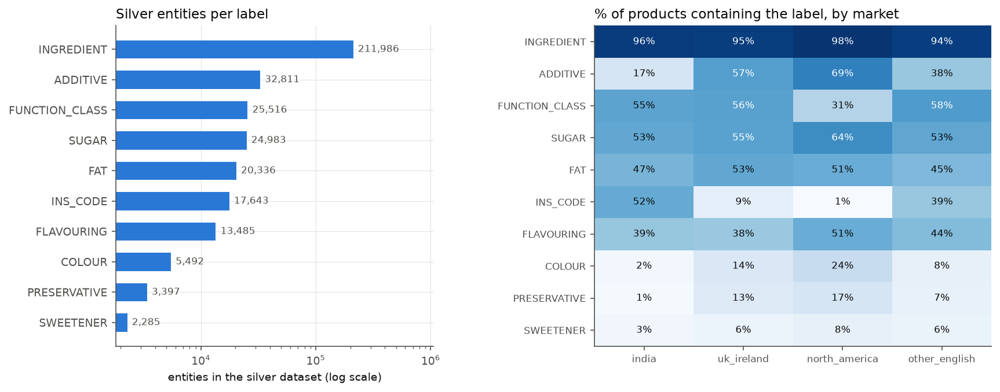
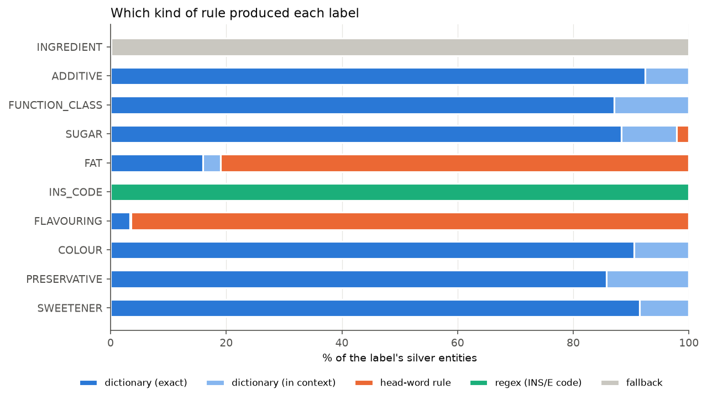

# Silver dataset statistics (auto-generated by `python -m src.labeling.silver_report`)

SILVER = produced automatically by dictionaries and rules. Not ground truth.

* Records: 22,323 (skipped: {'mostly non-Latin script': 31, 'too many tokens': 1})
* Tokens: 1,400,780; tagged O: 52.4%
* Entities: 357,934

| Label | Entities | % of products |
|---|---:|---:|
| INGREDIENT | 211,986 | 95.8% |
| ADDITIVE | 32,811 | 49.6% |
| FUNCTION_CLASS | 25,516 | 48.2% |
| SUGAR | 24,983 | 57.2% |
| FAT | 20,336 | 49.7% |
| INS_CODE | 17,643 | 19.9% |
| FLAVOURING | 13,485 | 43.3% |
| COLOUR | 5,492 | 13.9% |
| PRESERVATIVE | 3,397 | 10.9% |
| SWEETENER | 2,285 | 6.2% |

